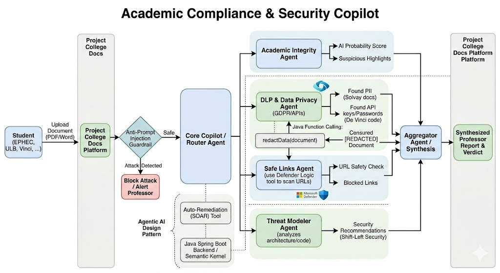

# Academic Compliance & Security Copilot (PoC)

## 📌 Overview
The **Academic Compliance & Security Copilot** is a Proof of Concept (PoC) demonstrating a Multi-Agent orchestration system built with **Java Spring Boot 3** and **Microsoft Semantic Kernel (v1.4.0)**.

Designed for the education sector, this intelligent backend analyzes student document submissions (PDF/Word) to detect academic misconduct, redact sensitive data (DLP), block malicious links, and prevent LLM manipulation (Prompt Injections).

## 🏗 Architecture & Workflow
This application relies on an Agentic AI Design Pattern. The workflow is as follows:

1. **Document Ingestion:** The user uploads a file (`.pdf`, `.docx`, `.txt`). **Apache Tika** extracts the raw text.
2. **Anti-Prompt Injection Guardrail:** Before processing, the request is validated by Azure AI's native Content Safety filters. If a jailbreak attempt is detected, the process halts immediately, throwing a custom `PromptInjectionException`.
3. **Core Copilot (Router):** The Semantic Kernel orchestrator analyzes the safe text and delegates tasks to specialized plugins (Agents).
4. **Specialized Agents (Function Calling):**
    * 🛡️ **DLP & Data Privacy Agent:** Uses Regex rules to find and mask Personally Identifiable Information (PII) and exposed API keys (`[REDACTED]`).
    * 🔗 **Safe Links Agent:** Simulates Microsoft Defender Threat Intelligence by scanning for and blocking known malicious URLs.
    * 🎓 **Academic Integrity Agent:** Analyzes the document's structure and syntax to calculate an AI-generation probability score.
5. **Synthesis:** The orchestrator compiles the findings from all agents and generates a synthesized "Professor Report & Verdict."

## 🚀 Prerequisites
* **Java 21** or higher
* **Maven**
* **Azure Account** with access to Azure OpenAI Service
* An active Azure OpenAI Deployment (e.g., `gpt-4o-mini` or `gpt-4o`) supporting API version `2024-12-01-preview` or later.

## ⚙️ Configuration & Setup

1. **Clone the repository:**
   ```bash
   git clone <your-repository-url>
   cd POCAIAgent